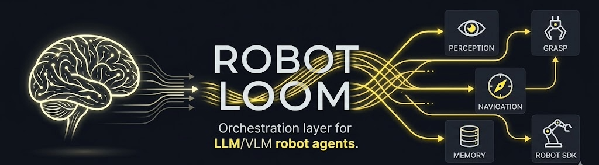
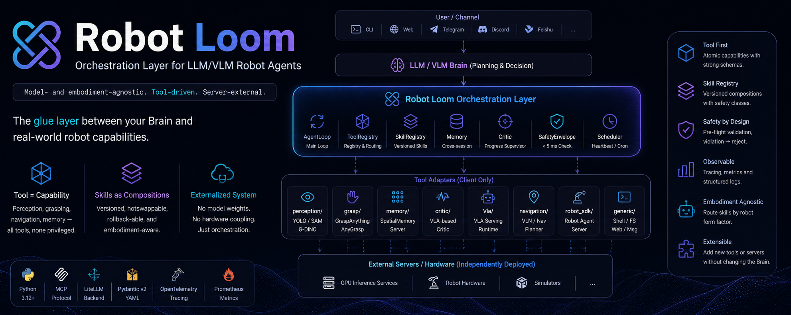

# Robot Loom

<p align="center">
  
</p>

**Model- and embodiment-agnostic orchestration layer for LLM/VLM-driven robot agents.**

The Brain doesn't touch the hardware — it drives everything through tool calls.

---

## What is it?

Robot Loom is the glue layer between an LLM/VLM planning brain and the fleet of capability servers that make a robot actually do things: perception, grasping, navigation, memory, progress evaluation, motion execution.

In practice, every robot AI team re-builds the same scaffolding: client adapters, tool schema validation, safety envelopes, skill orchestration, multi-robot coordination. The protocols are incompatible and the capabilities don't travel across platforms. This project extracts that layer so capabilities are independently replaceable, versioned, and reusable across robot form factors.

**Core stance:**
- Capability = tool. Perception, grasping, memory, VLA inference, navigation, robot SDK — all tools, none privileged.
- Servers are external. This repo holds client adapters only. No model weights, no GPU-resident processes.
- Skills are versioned tool compositions. Hotswappable, rollback-able, form-factor-routed.
- MCP is the default tool protocol. Capabilities wrap as MCP servers; the harness can also expose itself as one.

---

## Architecture

<p align="center">
  
</p>

### Layer table

| Layer | Responsibility | Rate / Deployment |
|---|---|---|
| **Channel** | User ingress: CLI / Web / Telegram / Voice (Discord / Feishu / DingTalk planned) | event-driven |
| **Brain** | LLM/VLM planning + tool call decisions | 1–7 Hz, can run cloud |
| **ToolRegistry** | Tool registration, schema validation, routing, call tracing | sync/async |
| **SkillRegistry** | Versioned tool-composition registry | mid-freq |
| **Memory** | Persistent memory (object / place / episodic / semantic) | async |
| **Critic** | Progress supervisor (not a controller) | 1–3 Hz |
| **Safety** | Pre-flight validation — violation → reject | sync, must be < 5 ms |
| **ToolAdapter** | Client adapter for an external capability server | per-tool |
| **EmbodimentAdapter** | Client adapter for a robot's onboard SDK | 50–200 Hz |
| **External Servers** | Inference services, robot hardware, simulators | **not in this repo** |

---

## Two core abstractions

### Tool — atomic capability

```
Characteristics: stateless or locally stateful / strong schema /
                 idempotent-retryable / cancellable

Examples:
  perception.detect_objects(image, classes)  → detections
  grasp.estimate_pose(image, target_id)      → grasp_pose
  robot_sdk.move_joint(robot_id, target)     → dispatch_handle
  memory.query(query, top_k)                 → hits
```

Tools are the Lego bricks the Brain freely composes.

### Skill — versioned tool composition

```
Characteristics: carries a SkillManifest (name / version (SemVer) /
                 embodiment_compat / safety_class / required_tools)
                 hotswappable · rollback-able · form-factor-routed

Example:
  pick_object v1.2.0 = detect → grasp_estimate → safety_check → dispatch → critic_judge
```

Skills are pre-validated, governed compositions. Confusing the two layers is the most common source of rot in agent codebases.

**Decision rule:** Does this capability need versioning, form-factor routing, or a safety class? → Skill. Is it a single atomic operation? → Tool.

---

## Tech stack

| Component | Choice |
|---|---|
| Language / runtime | Python 3.12+ async |
| Tool protocol (default) | **MCP** (stdio + Streamable HTTP) |
| Brain LLM backend | **LiteLLM** (OpenAI / Anthropic / vLLM / Ollama) |
| Skill manifest | YAML + Pydantic v2 |
| Serialization | msgpack (high-freq path) + JSON (config / management API) |
| Tracing | **OpenTelemetry** → Langfuse / Jaeger |
| Metrics | Prometheus |
| Testing | pytest + pytest-asyncio |
| Package manager | uv + hatchling |
| Robot SDK transport | HTTP/WS (per-robot FastAPI agent server); optional ROS 2 DDS |
| Simulators | Isaac Lab / RoboCasa / RoboTwin / LIBERO |

---

## Getting started

### Prerequisites

| Tool | Version |
|---|---|
| Python | 3.12+ |
| uv | latest |
| git | any |

Install uv:

```bash
# macOS / Linux
curl -LsSf https://astral.sh/uv/install.sh | sh

# Windows (PowerShell)
powershell -c "irm https://astral.sh/uv/install.ps1 | iex"
```

### Install

```bash
git clone https://github.com/zhang-jr/robot-loom.git
cd robot-loom

# Create virtual environment and install all dependencies (including dev extras)
uv sync --extra dev

# Verify
uv run python -c "import robot_harness; print('ok')"
```

### Initialize your workspace

Framework code and user assets are kept strictly separate. Your robot configs, custom skills, and private prompts live outside the repo:

```bash
uv run robot-loom init
# Creates ~/.robot-loom/workspace/ from the workspace_template/
```

### Run a task

Drive a single task through the Brain ⇄ tool-call loop:

```bash
uv run robot-loom run --task "inspect the shelf and report anything out of place"
# --robot-id <id>   target a specific robot (defaults to the first in config)
# --max-turns <n>   cap the agent loop (default 20)
```

Or run resident, routing channel messages into the loop:

```bash
uv run robot-loom serve --channel cli            # interactive terminal channel
uv run robot-loom serve --channel telegram       # reads TELEGRAM_BOT_TOKEN from env
uv run robot-loom serve --channel voice_gateway  # external voice gateway (finalized-utterance
                                                 # text over websocket; set channels.voice_gateway.url
                                                 # in config.yaml and install robot-loom[voice])
# --channel is repeatable; combine to serve several at once
```

Other entry points: `robot-loom tool list`, `robot-loom skill list` / `skill validate <manifest.yaml>`, `robot-loom fleet status`, and `robot-loom mcp serve` (expose the harness itself as an MCP server).

### Run tests

```bash
uv run pytest tests/unit/          # pure logic, no external dependencies
uv run pytest tests/integration/   # with auto-started mock servers
# hardware tests require real robots — skipped by default:
uv run pytest tests/hardware/ -m hardware
```

### Linting

```bash
uv run ruff check .
uv run ruff format --check .
```

Or install the pre-commit hooks so they run automatically on every commit:

```bash
uv run pre-commit install
```

---

## Project structure

```
robot-loom/
├── robot_harness/           # framework code (no user assets here)
│   ├── brain/               # LLM/VLM planning layer
│   ├── tools/               # ★ first-class abstraction ★
│   │   ├── base.py          # Tool Protocol + ToolRegistry
│   │   ├── middleware/      # retry / cache / circuit-breaker / trace
│   │   ├── mcp/             # MCP client + server wrapper
│   │   ├── perception/      # vision adapters (YOLO / Depth / SAM / G-DINO)
│   │   ├── grasp/           # grasp estimation adapters
│   │   ├── memory/          # memory operation adapters
│   │   ├── critic/          # progress critic adapters
│   │   ├── vla/             # VLA serving adapters
│   │   ├── navigation/      # navigation adapters
│   │   ├── robot_sdk/       # per-robot embodiment SDK adapters
│   │   └── generic/         # shell / fs / web / messaging
│   ├── skill/               # versioned skill registry + lifecycle
│   ├── memory/              # local index + remote memory server adapter
│   ├── critic/              # critic protocol + joint decision policy
│   ├── embodiment/          # EmbodimentAdapter per form-factor
│   ├── safety/              # SafetyEnvelope (mandatory pre-flight)
│   ├── fleet/               # multi-robot coordination + leasing
│   ├── runtime/             # AgentLoop + HarnessContext + Scheduler
│   ├── channels/            # CLI / Web / Telegram / Voice (Discord / Feishu / DingTalk planned)
│   ├── observability/       # OTel tracer + Prometheus metrics
│   ├── data/                # episode buffer schema (training pipeline not included)
│   ├── config/              # config loader + schema + paths
│   └── errors.py            # unified exception hierarchy
│
├── workspace_template/      # copied to ~/.robot-loom/workspace/ on init
│   ├── MISSION.md
│   ├── ROBOT.md
│   ├── HEARTBEAT.md
│   ├── tools/               # user-defined MCP servers / native tools
│   └── skills/              # user-defined skills
│
├── examples/
│   ├── pickplace_minimal.py
│   ├── multi_robot_inspect.py
│   └── memory_grounded_nav.py
│
├── benchmarks/
├── tests/
│   ├── unit/                # CI: runs on every push
│   ├── integration/         # CI: runs on every push (mock servers auto-started)
│   └── hardware/            # CI: skipped by default, @pytest.mark.hardware
└── docs/
    ├── architecture.md      # concept layers, data-flow walkthrough, interface quick-ref
    ├── onboarding.md        # environment setup, first-week path, team assignments
    ├── contributing.md      # branch naming, commit format, PR checklist, review guide
    └── coding-style.md      # annotated examples for every coding convention
```

---

## Safety

`SafetyEnvelope.check()` is a mandatory pre-flight gate on every hardware-bound action. Violation raises `SafetyEnvelopeViolation` which triggers an emergency stop and a persistent audit log entry. It cannot be caught and silenced — that is by design.

- **All safety checks are 100% persisted to the audit log.**
- **`SafetyEnvelope` must never be mocked in tests.** Safety tests must use the real validation logic.
- Hardware-bound PRs must carry `@pytest.mark.hardware` and be reviewed by at least two people.

---

## Contributing

See [`docs/contributing.md`](docs/contributing.md) for the full guide: branch naming, commit format, PR checklist, and review criteria.

Quick reference:

```bash
# before opening a PR
uv run pytest tests/unit/ tests/integration/
uv run ruff check .
uv run ruff format --check .
```

Commit format: `<type>(<scope>): <description>`

```
feat(tool): add MCP client with stdio transport
fix(safety): prevent SafetyEnvelopeViolation from being swallowed
refactor(skill): extract hotswap logic into SwapHandle
```

---

## License

Apache 2.0 — see [LICENSE](LICENSE).
